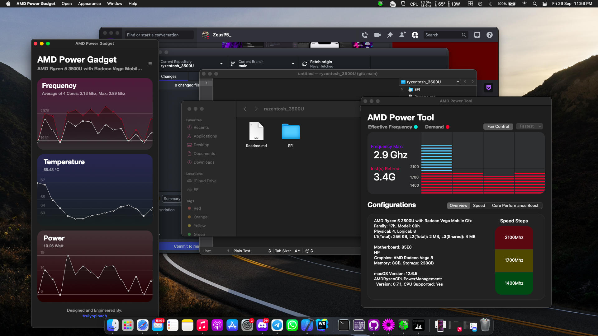

# Ryzentosh on HP Laptop 14s-dk0xxx (AMD Ryzen 5 3500U)

## Hardware Specifications
- **CPU**: AMD Ryzen 5 3500U with Radeon Vega Mobile Gfx (4 cores, 8 threads)
- **RAM**: 16GB Dual Channel (8GB Hynix @ 2400MHz + 8GB @ 2667MHz)
- **Graphics**: AMD Radeon Vega 8 Mobile
- **OS**: macOS Monterey

## What Works
- [x] iGPU Acceleration
- [x] Touchpad with gestures
- [x] Keyboard with function keys
- [x] Ethernet
- [x] Audio input/output
- [x] AppleID & iServices
- [x] HDMI output
- [x] USB Ports
- [x] Dual RAM configuration with mixed speeds
- [x] Sleep/Wake
- [x] Battery management

## OpenCore Configuration
- **Version**: 0.9.x
- **Boot Arguments**: `-v agdpmod=pikera cpuid_max_ext=16 -xcpm=0`
- **Key Quirks**:
  - Enabled `RebuildAppleMemoryMap`
  - Enabled `SetupVirtualMap`
  - Enabled `SyncRuntimePermissions`

## Notes
- Successfully configured for mixed RAM speeds (2400MHz + 2667MHz)
- Properly running in dual-channel mode for 40-60% memory performance improvement
- System successfully boots to macOS Monterey
